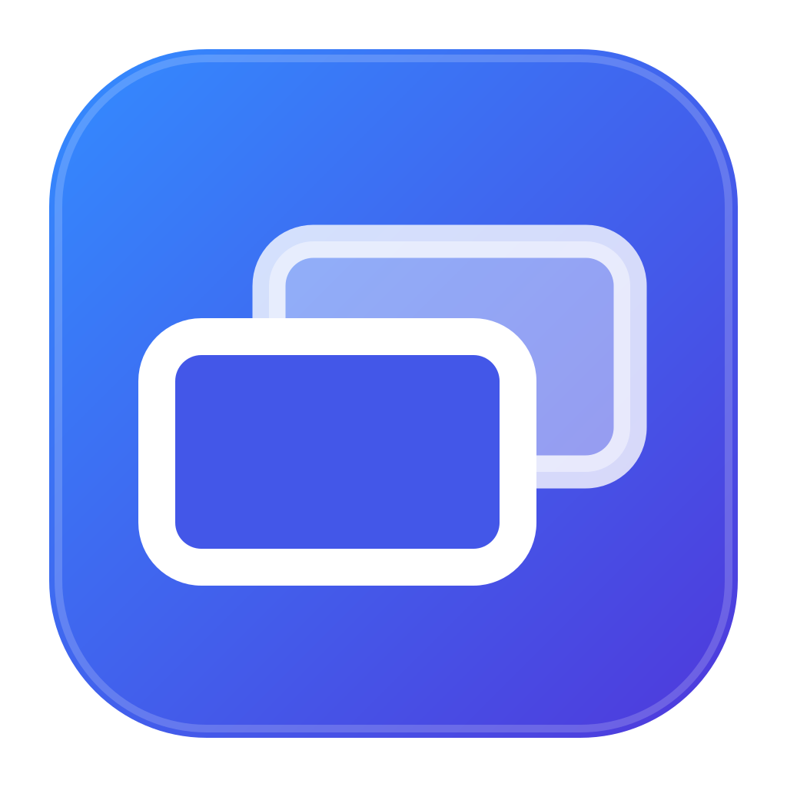

<p align="center">
  
</p>

# LAN Capture

LAN Capture sends a Mac display to OBS over a local network. The receiving computer can use any operating system that supports OBS.

The app captures video with ScreenCaptureKit and encodes H.264 with VideoToolbox. FFmpeg sends the encoded video as MPEG-TS over SRT.

> LAN Capture sends video only. It does not send system audio.

## Features

- Menu-bar controls for the stream and video settings
- The local IPv4 address and a copyable OBS input URL
- Hardware H.264 encoding through VideoToolbox
- SRT listener mode, so the Mac does not require the receiver address
- Configurable width, height, frame rate, bitrate, and port
- Center cropping or a blurred background for different aspect ratios
- Automatic FFmpeg discovery

## Requirements

LAN Capture requires:

- macOS 13 or later
- FFmpeg with SRT support
- OBS Studio on the receiving computer
- A local network connection between both computers

A wired network gives the most consistent results for 1080p at 60 fps.

The source build also requires the Xcode command-line tools.

## Install FFmpeg

LAN Capture does not include FFmpeg. Install `ffmpeg-full` with Homebrew:

```sh
brew install ffmpeg-full
```

The standard Homebrew `ffmpeg` formula does not include SRT support. LAN Capture accepts only an FFmpeg executable that lists the SRT protocol.

LAN Capture searches for FFmpeg in this order:

1. The path in `LANCAPTURE_FFMPEG_PATH`.
2. Each directory in `PATH`.
3. The result from `command -v ffmpeg` in the login shell.
4. The Homebrew prefixes for `ffmpeg-full` and `ffmpeg`.

No Homebrew path is compiled into the app.

## Install LAN Capture

### Download a release

1. Download the macOS ZIP file from the GitHub Releases page.
2. Extract `LAN Capture.app`.
3. Move the app to the Applications folder.
4. Open the app.

If macOS blocks an unsigned build, Control-click the app and select **Open**. Signed and notarized releases open normally.

### Build from source

```sh
./scripts/build-app.sh
open 'dist/LAN Capture.app'
```

The build script uses a signing identity from the login keychain when one is available. You can select an identity explicitly:

```sh
LANCAPTURE_SIGNING_IDENTITY='Developer ID Application: Your Name (TEAMID)' \
  ./scripts/build-app.sh
```

If the script cannot find an identity, it uses an ad-hoc signature. macOS can request screen-recording permission again after an ad-hoc rebuild.

## Grant screen-recording access

1. Open LAN Capture.
2. Click **Start Stream**.
3. Open System Settings when macOS requests screen-recording access.
4. Enable access for LAN Capture.
5. Quit and reopen LAN Capture if the first stream does not send frames.

LAN Capture is a regular macOS app. It appears in the menu bar, Dock, and Force Quit window.

## Connect OBS

1. Open LAN Capture on the Mac.
2. Click the menu-bar icon.
3. Set the output size, frame rate, bitrate, and listen port.
4. Click **Start Stream**.
5. Copy the OBS input URL.
6. Add a **Media Source** in OBS.
7. Clear **Local File**.
8. Enter these values:

```text
Input: srt://MAC_IP:9000?latency=20000
Input Format: mpegts
Network Buffering: 0 MB
```

Use the input URL from the app instead of typing `MAC_IP`. Enable hardware decoding in OBS when it is available.

LAN Capture listens for an SRT connection. OBS connects to the Mac, so LAN Capture does not require the receiver address.

The default output is 1920×1080 at 60 fps and 20 Mbps. The default listen port is 9000.

## Control the output shape

LAN Capture always fills the requested output dimensions.

The default mode center-crops the display when the display and output use different aspect ratios.

Enable **Blur background instead of cropping** to preserve the full display. The app fills the unused area with blurred display content.

OBS reads the width and height from the H.264 stream. Do not add these values to the OBS input URL.

## Reduce latency

- Use a wired network when possible.
- Set **Network Buffering** to `0 MB` in the OBS Media Source.
- Keep the sender and receiver on the same local network.
- Reduce the bitrate or frame rate if the network drops packets.

The `latency=20000` value sets a 20 ms SRT latency. OBS buffering and video decoding can add more delay.

## Use a custom FFmpeg path

Set `LANCAPTURE_FFMPEG_PATH` before you open the app:

```sh
export LANCAPTURE_FFMPEG_PATH='/path/to/ffmpeg'
open 'dist/LAN Capture.app'
```

The selected executable must support SRT.

## Development

Run the tests:

```sh
swift test
```

Build the release app:

```sh
./scripts/build-app.sh
```

The pull-request workflow runs the tests and builds an ad-hoc signed app. The same workflow runs for each push to `main`.

## Create a release

Push a semantic-version tag to start the release workflow:

```sh
git tag v0.1.0
git push origin v0.1.0
```

The workflow runs the tests, builds the app, creates a ZIP file and checksum, and publishes a GitHub release.

The workflow creates an ad-hoc signed release when signing secrets are absent. Configure these repository secrets for signed and notarized releases:

- `MACOS_CERTIFICATE`: A base64-encoded Developer ID Application certificate in PKCS #12 format.
- `MACOS_CERTIFICATE_PASSWORD`: The password for the PKCS #12 file.
- `APPLE_ID`: The Apple ID for notarization.
- `APPLE_TEAM_ID`: The Apple Developer team identifier.
- `APPLE_APP_PASSWORD`: An app-specific password for the Apple ID.

The release tag sets `CFBundleShortVersionString`. The GitHub Actions run number sets `CFBundleVersion`.
